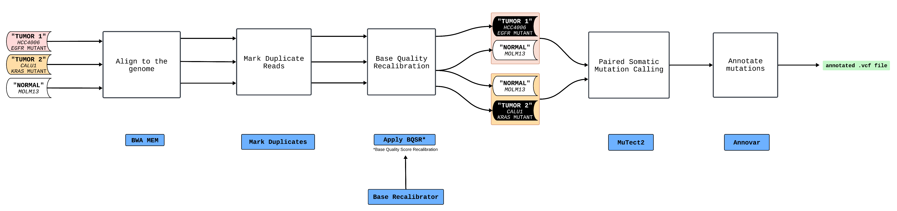

```{r, include = FALSE}
ottrpal::set_knitr_image_path()
```

# Defining a workflow plan

Our WDL guide will center around building a workflow from scratch. As we build out this workflow step-by-step, you will see what strategies and resources are used to develop a workflow that is iterative, reproducible, and efficient in terms of time and resource used. The goal is to use this workflow to illustrate common lessons in writing WDL workflows.

## Somatic mutation calling workflow

The workflow used as the example  here is tailored to detect somatic mutations in two tumor samples. Initially, the workflow takes as input FASTQ-formatted sequencing data from two tumor specimens and one normal sample (a single normal sample is used here, but typically each tumor might have its own associated normal). Subsequently, it aligns the FASTQ files of each sample with the human reference genome (hg19), proceeds to identify and mark PCR duplicates, and conducts base quality recalibration. Following these steps, the workflow engages in somatic mutation calling, operating in a paired mode, to pinpoint mutations unique to the tumor samples in comparison to the normal one. Concluding the process, the workflow undertakes the annotation of the identified mutations, enriching the dataset with additional insights into the nature of the mutations detected.

The workflow schematic:



The tasks involved:

1.  `BwaMem` aligns the samples to the reference genome (hg19).
2.  `MarkDuplicates` marks PCR duplicates.
3.  `ApplyBaseRecalibrator` perform base quality recalibration.
4.  `Mutect2` performs paired somatic mutation calling.
5.  `annovar` annotates the called somatic mutations.

## Workflow testing strategy

As we build out our workflow, how do we know it is running correctly besides getting a message such as "Workflow finished with status 'Succeeded'" or an exit code 0? In [software development](https://www.atlassian.com/continuous-delivery/software-testing), it is essential to test your code to see whether it generates the expected output given a specified input. This principle applies into bioinformatics workflow development also:

1.  Unit Testing: We need to incorporate tests to ensure that each task we develop is correct.

2.  End-to-end testing: When we connect all the tasks together to form a workflow, we test that the workflow running end-to-end is correct.

Here are some guidelines for any form of testing:

-   The data you use for testing is representative of "real" data.

-   You have an expectation of what the resulting output is *before* you run your workflow on it. It can be as specific as a MD5 checksum, or vague such as a certain file format.

-   The process is quick to run, ideally in the range of just a few minutes. This often means using a small subset of actual data.

-   The data you use for testing is ideally open access so others can verify your workflow also.

Here is our proposed end-to-end testing strategy: We will use samples from the [Cancer Cell Line Encyclopedia Project](https://sites.broadinstitute.org/ccle/), which are well characterized open access cell lines. In particular, we will use the `xxx` sample that has a KRAS somatic mutation as a tumor sample, and use the `xxx` sample that does *not* have a KRAS somatic mutation as a control sample. We will take pre-aligned BAM files of these two samples, filter for mapped reads a few hundred base pairs around KRAS, and convert them into unmapped FASTQ files. These are our paired test samples, and once they run through the workflow, we would expect to find KRAS somatic mutations. We will discuss unit testing as we write out each task.
