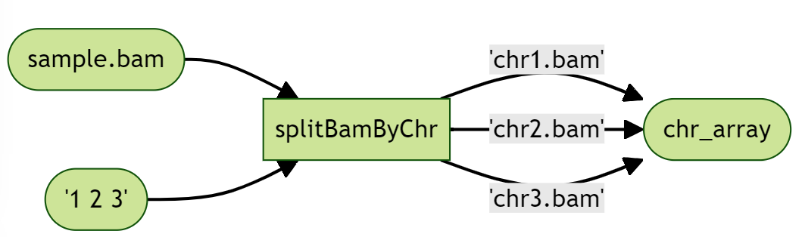

# Optimization

In our last chapter, we will explore ways to optimize our completed workflow.

Generally, in computing, we are working with the following finite resources:

-   **Computing time**: a task can take milliseconds to days to complete. We find ways to reduce our computing time so that we have results sooner.

-   **Central Processing Unit (CPU) usage**: a task requires at least one CPU to be the "brain" of the computer to run computation, move data around, and access the memory. Tasks can make use of multiple CPUs to process in parallel. 

-   **Memory usage (RAM)**: a task needs a place to store data while computing on the job. Reducing the memory usage can allow the task to be more efficient.

-   **Disk usage**: A task usually requires some input data and have an output, and needs disk storage to store the information when the task isn't running.

Changing usage of any of these resources often affect other resources. For instance, there's often a tradeoff between computing time and memory usage. In order to be efficient with these finite resources, we will introduce some optimization methods that are common in building an efficient workflow, and provide an example on a simple optimization method, "Embarrassingly Parallel Scatter-Gather".

## Common optimizing/parallelizing methods

### Memory optimization

To optimize the amount of memory used for a task, you can profile the task to understand how much memory is being used and where the bottlenecks are. Most programming languages have a large selection of memory profilers to analyze the performance of your code, and they can be starting points to consider how to use less memory. When a bottleneck is found, you might consider to use a more efficient algorithm to reduce memory usage. Or, perhaps you might use more optimal data structures, such as databases or sparse data structures, that better fit the data type of your problem.

Another common memory analysis is to understand how memory usage scales relative to the input for the task. For example, as you increase the VCF file size for a task, how much does the memory usage scale? Is there something you can do so that it scales with a smaller magnitude?

A technique you may want to consider if your memory usage scales with your input data size is that you could break down the input into smaller parts, and run your task on these smaller parts, each requesting smaller amount of memory. This wouldn't reduce the total amount of memory you use, but many computing backends prefer many tasks using small amounts of a memory instead of a single job requiring a large amount of memory. This would also help optimizing computing time. Below, we look at different ways of parallelization.

### Embarrassingly Parallel Scatter-Gather

A sub-task is called "Embarrassingly Parallel" if the sub-task can be run completely independent of other sub-tasks to finish the task. When we run multiple samples in our workflow, it is a form of "Embarrassingly Parallel", because processing each tumor-normal pair through the workflow is done independently of other samples on separate computers (also known in high performance computing as "nodes"). This technique reduces the computing time and breaks down CPU and memory usage into smaller, more affordable resource requests. Later in this chapter we will show an detailed example of using this technique to split a BAM into individual chromosomes to run a resource demanding task.

### Multithreading (Shared-Memory Parallelism)

Sometimes, you want to use multiple CPUs on a single computer to run sub-components of your task in parallel. This is called "multithreading". Here, a single task accesses multiple CPUs on a computer to split up the task, and these CPUs share the same memory. Due to shared memory, each of these CPUs are not quite independent, and some communication is needed between CPUs to make this efficient. Well-documented and optimized bioinformatics software will often have usage options to use multiple cores to speed up the task. In our previous chapters, we used BWA MEM with an optional default of 16 CPUs. If you are developing your own task, then there are many built in operations that can make use of multiple CPUs, as well as low-level threading methods to help you develop a multi-threaded program.

### Multiprocessing (Distributed-Memory Parallelism)

Sometimes, the scale of the work requires coordination of multiple computers working dependently of each other. This is called "multiprocessing". This is common in working with large scale data, using tools such as Spark or Hadoop. We will not be talking about multiprocessing extensively in this guide.

### Graphical Processing Units (GPUs)

Graphical processing units are an additional processing tool to CPUs, in which a different computer hardware is used. There are usually a few handful of CPUs on a computer, but there can be thousands of GPUs, each capable of doing a small and simple task quickly. GPUs are used for graphical displays, and scientific computing problems such as training neutral networks and solving differential equations. We will not be talking about GPUs extensively in this guide.

## Scatter-Gather on chromosomes


Suppose that one our tasks, `ApplyBaseRecalibrator`, is taking too long to run and taking on too much memory. We might first look into the [tool's documentation](https://gatk.broadinstitute.org/hc/en-us/articles/360036898312-BaseRecalibrator) to see if there are ways use it more optimally, such as provide more CPUs, but we don't see it. We turn to Embarrassingly Parallel Scatter-Gather, in which we split a BAM file by its chromosomes to create 23 BAM files, run `ApplyBaseRecalibrator` on each of these BAMs, and merge all of these calibrated BAM files together. This is called "Scatter-Gather" because we have to scatter our BAMs into smaller parts to run, and then gather them together in the end.



We first write a new task to split our BAM file, which takes the original BAM, an array of chromosomes to scatter, and outputs an array of Files of the smaller BAM files. The output array of Files is stored as `bams` and `indexFiles`, and illustrated in the diagram as "chr_array". 

```         
# Split a BAM file by chromosomes
task splitBamByChr {
  input {
    File bamToSplit
    File baiToSplit
    Array[String] chromosomes
  }

  String baseFileName = basename(bamToSplit, ".bam")

  command <<<
    set -eo pipefail
    #For each chromosome...
    for x in ~{sep=' ' chromosomes}; do
      outputFile="~{baseFileName}_${x}.bam"
      samtools view -b -@ 3 "~{bamToSplit}" $x > $outputFile
      samtools index $outputFile
    done
    # List all bam and bai files created
    ls *.bam > bam_list.txt
    ls *.bam.bai > bai_list.txt
  >>>
    
  output {
    Array[File] bams = read_lines("bam_list.txt")
    Array[File] indexFiles = read_lines("bai_list.txt")
  }

  runtime {
    docker: "fredhutch/bwa:0.7.17"
    cpu: 4
  }
```


We also need a task to gather all the BAMs together, which takes in an array of Files, and outputs a merged BAM. The input array of Files is referred as `bams`, and illustrated in the diagram as `chr_array`. 

```         
#Gather an array of BAMs
task gatherBams {
  input {
    Array[File] bams
    String clean_baseName_regex
  }

  String temp = basename(bams[0], ".bam")
  String baseFileName = sub(temp, clean_baseName_regex, "")

  command <<<
    set -eo pipefail
    samtools merge -c -@3 "~{baseFileName}".merged.bam ~{sep=' ' bams}
    samtools index "~{baseFileName}".merged.bam
  >>>
    
  runtime {
      cpu: 4
      docker: "fredhutch/bwa:0.7.17"
  }
  
  output {
    File merged_bam = "~{baseFileName}.merged.bam"
    File merged_bai = "~{baseFileName}.merged.bam.bai"
  }
}
```

In our workflow, after `MarkDuplicates` task, we first use `splitBamByChr` to divvy up our BAM file, and then use a scatter over the output array of scattered BAMs to run `ApplyBaseRecalibrator` on each of the scatted BAMs. Finally, we take the output of `ApplyBaseRecalibrator` as an array to be merged together via `gatherBams`:


```         
#Split by chromosomes
  call splitBamByChr as tumorSplitBamByChr {
    input:
      bamToSplit = tumorMarkDuplicates.markDuplicates_bam,
      baiToSplit = tumorMarkDuplicates.markDuplicates_bai,
      chromosomes = chrs_to_split
  }

#Scatter by chromosomes
scatter(i in range(length(tumorSplitBamByChr.indexFiles))) {
  File tumorSubBam = tumorSplitBamByChr.bams[i]
  File tumorSubBamIndex = tumorSplitBamByChr.indexFiles[i]

  call ApplyBaseRecalibrator as tumorApplyBaseRecalibrator {
    input:
      input_bam = tumorSubBam,
      input_bam_index = tumorSubBamIndex,
      dbSNP_vcf = dbSNP_vcf,
      dbSNP_vcf_index = dbSNP_vcf_index,
      known_indels_sites_VCFs = known_indels_sites_VCFs,
      known_indels_sites_indices = known_indels_sites_indices,
      refGenome = refGenome
  }
}

#Gather all chromosomes together      
call gatherBams as tumorGatherBams {
  input:
    bams = tumorApplyBaseRecalibrator.recalibrated_bam,
    clean_baseName_regex = ".duplicates_marked_12.recal"
}
```

Our final workflow:

```         
version 1.0
## WDL 101 example workflow
## 
## This WDL workflow is intended to be used along with the WDL 101 docs. 
## This workflow should be used for inspiration purposes only. 
##
## We use three samples 
## Samples:
## MOLM13: Normal sample
## CALU1: KRAS G12C mutant
## HCC4006: EGFR Ex19 deletion mutant 
##
## Input requirements:
## - combined fastq files for chromosome 12 and 7 +/- 200bp around the sites of mutation only
##
## Output Files:
## - An aligned bam for all 3 samples (with duplicates marked and base quality recalibrated)
## 
## Workflow developed by Sitapriya Moorthi, Chris Lo and Taylor Firman @ Fred Hutch and Ash (Aisling) O'Farrell @ UCSC LMD: 02/28/24 for use @ Fred Hutch.

struct referenceGenome {
    File ref_fasta
    File ref_fasta_index
    File ref_dict
    File ref_amb
    File ref_ann
    File ref_bwt
    File ref_pac
    File ref_sa
    String ref_name
}

struct pairedSample {
  File tumorSample
  File normalSample
}


workflow mutation_calling {
  input {
    Array[pairedSample] samples

    referenceGenome refGenome

    # Optional variable for bwa mem
    Int? bwa_mem_threads
    
    # Files for specific tools
    File dbSNP_vcf
    File dbSNP_vcf_index
    File known_indels_sites_VCFs
    File known_indels_sites_indices
    File af_only_gnomad
    File af_only_gnomad_index

    # Annovar options
    String annovar_protocols
    String annovar_operation

    #Chromosomes to scatter over
    Array[String] chrs_to_split = ["12", "7"]
  }

 
  # Scatter for each sample in samples
  scatter (sample in samples) {

    #Tumors
    call BwaMem as tumorBwaMem {
      input:
        input_fastq = sample.tumorSample,
        refGenome = refGenome,
        threads = bwa_mem_threads
    }
    
    call MarkDuplicates as tumorMarkDuplicates {
      input:
        input_bam = tumorBwaMem.analysisReadySorted
    }

    #Split by chromosomes
    call splitBamByChr as tumorSplitBamByChr {
      input:
        bamToSplit = tumorMarkDuplicates.markDuplicates_bam,
        baiToSplit = tumorMarkDuplicates.markDuplicates_bai,
        chromosomes = chrs_to_split
    }

    #Scatter by chromosomes
    scatter(i in range(length(tumorSplitBamByChr.indexFiles))) {
      File tumorSubBam = tumorSplitBamByChr.bams[i]
      File tumorSubBamIndex = tumorSplitBamByChr.indexFiles[i]

      call ApplyBaseRecalibrator as tumorApplyBaseRecalibrator {
        input:
          input_bam = tumorSubBam,
          input_bam_index = tumorSubBamIndex,
          dbSNP_vcf = dbSNP_vcf,
          dbSNP_vcf_index = dbSNP_vcf_index,
          known_indels_sites_VCFs = known_indels_sites_VCFs,
          known_indels_sites_indices = known_indels_sites_indices,
          refGenome = refGenome
      }
    }

    #Gather all chromosomes together      
    call gatherBams as tumorGatherBams {
      input:
        bams = tumorApplyBaseRecalibrator.recalibrated_bam,
        clean_baseName_regex = ".duplicates_marked_12.recal"
    }
  

    #Normals
    call BwaMem as normalBwaMem {
      input:
        input_fastq = sample.normalSample,
        refGenome = refGenome,
        threads = bwa_mem_threads
    }
    
    call MarkDuplicates as normalMarkDuplicates {
      input:
        input_bam = normalBwaMem.analysisReadySorted
    }
  
    #Split by chromosomes
    call splitBamByChr as normalSplitBamByChr {
      input:
        bamToSplit = normalMarkDuplicates.markDuplicates_bam,
        baiToSplit = normalMarkDuplicates.markDuplicates_bai,
        chromosomes = chrs_to_split
    }

    #Scatter by chromosomes
    scatter(i in range(length(normalSplitBamByChr.indexFiles))) {
      File normalSubBam = normalSplitBamByChr.bams[i]
      File normalSubBamIndex = normalSplitBamByChr.indexFiles[i]

      call ApplyBaseRecalibrator as normalApplyBaseRecalibrator {
        input:
          input_bam = normalSubBam,
          input_bam_index = normalSubBamIndex,
          dbSNP_vcf = dbSNP_vcf,
          dbSNP_vcf_index = dbSNP_vcf_index,
          known_indels_sites_VCFs = known_indels_sites_VCFs,
          known_indels_sites_indices = known_indels_sites_indices,
          refGenome = refGenome
      }
    }

    #Gather all chromosomes together      
    call gatherBams as normalGatherBams {
      input:
        bams = normalApplyBaseRecalibrator.recalibrated_bam,
        clean_baseName_regex = ".duplicates_marked_12.recal"
    }
       
    #Paired Tumor-Normal calling
    call Mutect2Paired {
      input:
        tumor_bam = tumorGatherBams.merged_bam,
        tumor_bam_index = tumorGatherBams.merged_bai,
        normal_bam = normalGatherBams.merged_bam,
        normal_bam_index = normalGatherBams.merged_bai,
        refGenome = refGenome,
        genomeReference = af_only_gnomad,
        genomeReferenceIndex = af_only_gnomad_index
    }

    call annovar {
      input:
        input_vcf = Mutect2Paired.output_vcf,
        ref_name = refGenome.ref_name,
        annovar_operation = annovar_operation,
        annovar_protocols = annovar_protocols
    }
}

  output {
    Array[File] tumoralignedBamSorted = tumorBwaMem.analysisReadySorted
    Array[File] tumorMarkDuplicates_bam = tumorMarkDuplicates.markDuplicates_bam
    Array[File] tumorMarkDuplicates_bai = tumorMarkDuplicates.markDuplicates_bai
    Array[File] tumoranalysisReadyBam = tumorGatherBams.merged_bam
    Array[File] tumoranalysisReadyIndex = tumorGatherBams.merged_bai
    Array[File] normalalignedBamSorted = normalBwaMem.analysisReadySorted
    Array[File] normalmarkDuplicates_bam = normalMarkDuplicates.markDuplicates_bam
    Array[File] normalmarkDuplicates_bai = normalMarkDuplicates.markDuplicates_bai
    Array[File] normalanalysisReadyBam = normalGatherBams.merged_bam
    Array[File] normalanalysisReadyIndex = normalGatherBams.merged_bai
    Array[File] Mutect2Paired_Vcf = Mutect2Paired.output_vcf
    Array[File] Mutect2Paired_VcfIndex = Mutect2Paired.output_vcf_index
    Array[File] Mutect2Paired_AnnotatedVcf = annovar.output_annotated_vcf
    Array[File] Mutect2Paired_AnnotatedTable = annovar.output_annotated_table
  }

  parameter_meta {
    tumorSamples: "Tumor .fastq, one sample per .fastq file (expects Illumina)"
    normalFastq: "Non-tumor .fastq (expects Illumina)"

    dbSNP_vcf: "dbSNP VCF for mutation calling"
    dbSNP_vcf_index: "dbSNP VCF index"
    known_indels_sites_VCFs: "Known indel site VCF for mutation calling"
    known_indels_sites_indices: "Known indel site VCF indicies"
    af_only_gnomad: "gnomAD population allele fraction for mutation calling"
    af_only_gnomad_index: "gnomAD population allele fraction index"

    annovar_protocols: "annovar protocols: see https://annovar.openbioinformatics.org/en/latest/user-guide/startup"
    annovar_operation: "annovar operation: see https://annovar.openbioinformatics.org/en/latest/user-guide/startup"
  }
}

####################
# Task definitions #
####################

# Align fastq file to the reference genome
task BwaMem {
  input {
    File input_fastq
    referenceGenome refGenome
    Int threads = 16  # if a workflow passes an optional variable with no value, fall back to 16
  }
  
  String base_file_name = basename(input_fastq, ".fastq")
  String ref_fasta_local = basename(refGenome.ref_fasta)

  String read_group_id = "ID:" + base_file_name
  String sample_name = "SM:" + base_file_name
  String platform_info = "PL:illumina"


  command <<<
    set -eo pipefail

    mv "~{refGenome.ref_fasta}" .
    mv "~{refGenome.ref_fasta_index}" .
    mv "~{refGenome.ref_dict}" .
    mv "~{refGenome.ref_amb}" .
    mv "~{refGenome.ref_ann}" .
    mv "~{refGenome.ref_bwt}" .
    mv "~{refGenome.ref_pac}" .
    mv "~{refGenome.ref_sa}" .

    bwa mem \
      -p -v 3 -t ~{threads} -M -R '@RG\t~{read_group_id}\t~{sample_name}\t~{platform_info}' \
      "~{ref_fasta_local}" "~{input_fastq}" > "~{base_file_name}.sam" 
    samtools view -1bS -@ 15 -o "~{base_file_name}.aligned.bam" "~{base_file_name}.sam"
    samtools sort -@ 15 -o "~{base_file_name}.sorted_query_aligned.bam" "~{base_file_name}.aligned.bam"
  >>>

  output {
    File analysisReadySorted = "~{base_file_name}.sorted_query_aligned.bam"
  }
  
  runtime {
    memory: "48 GB"
    cpu: 16
    docker: "ghcr.io/getwilds/bwa:0.7.17"
  }
}

# Mark duplicates on a BAM file
task MarkDuplicates {
  input {
    File input_bam
  }

  String base_file_name = basename(input_bam, ".sorted_query_aligned.bam")

  command <<<
    gatk MarkDuplicates \
      --INPUT "~{input_bam}" \
      --OUTPUT "~{base_file_name}.duplicates_marked.bam" \
      --METRICS_FILE "~{base_file_name}.duplicate_metrics" \
      --CREATE_INDEX true \
      --OPTICAL_DUPLICATE_PIXEL_DISTANCE 100 \
      --VALIDATION_STRINGENCY SILENT
  >>>

  runtime {
    docker: "ghcr.io/getwilds/gatk:4.3.0.0"
    memory: "48 GB"
    cpu: 4
  }

  output {
    File markDuplicates_bam = "~{base_file_name}.duplicates_marked.bam"
    File markDuplicates_bai = "~{base_file_name}.duplicates_marked.bai"
    File duplicate_metrics = "~{base_file_name}.duplicates_marked.bai"
  }
}

# Base quality recalibration
task ApplyBaseRecalibrator {
  input {
    File input_bam
    File input_bam_index
    File dbSNP_vcf
    File dbSNP_vcf_index
    File known_indels_sites_VCFs
    File known_indels_sites_indices
    referenceGenome refGenome
  }
  
  String base_file_name = basename(input_bam, ".bam")
  
  String ref_fasta_local = basename(refGenome.ref_fasta)
  String dbSNP_vcf_local = basename(dbSNP_vcf)
  String known_indels_sites_VCFs_local = basename(known_indels_sites_VCFs)


  command <<<
  set -eo pipefail

  mv "~{refGenome.ref_fasta}" .
  mv "~{refGenome.ref_fasta_index}" .
  mv "~{refGenome.ref_dict}" .

  mv "~{dbSNP_vcf}" .
  mv "~{dbSNP_vcf_index}" .

  mv "~{known_indels_sites_VCFs}" .
  mv "~{known_indels_sites_indices}" .

  samtools index "~{input_bam}"

  gatk --java-options "-Xms8g" \
      BaseRecalibrator \
      -R "~{ref_fasta_local}" \
      -I "~{input_bam}" \
      -O "~{base_file_name}.recal_data.csv" \
      --known-sites "~{dbSNP_vcf_local}" \
      --known-sites "~{known_indels_sites_VCFs_local}" \
      

  gatk --java-options "-Xms8g" \
      ApplyBQSR \
      -bqsr "~{base_file_name}.recal_data.csv" \
      -I "~{input_bam}" \
      -O "~{base_file_name}.recal.bam" \
      -R "~{ref_fasta_local}" \
      

  # finds the current sort order of this bam file
  samtools view -H "~{base_file_name}.recal.bam" | grep @SQ | sed 's/@SQ\tSN:\|LN://g' > "~{base_file_name}.sortOrder.txt"
  >>>

  output {
    File recalibrated_bam = "~{base_file_name}.recal.bam"
    File recalibrated_bai = "~{base_file_name}.recal.bai"
    File sortOrder = "~{base_file_name}.sortOrder.txt"
  }
  runtime {
    memory: "36 GB"
    cpu: 2
    docker: "ghcr.io/getwilds/gatk:4.3.0.0"
  }
}

# Variant calling via mutect2 (tumor-and-normal mode)
task Mutect2Paired {
  input {
    File tumor_bam
    File tumor_bam_index
    File normal_bam
    File normal_bam_index
    referenceGenome refGenome
    File genomeReference
    File genomeReferenceIndex
  }

  String base_file_name_tumor = basename(tumor_bam, ".recal.bam")
  String ref_fasta_local = basename(refGenome.ref_fasta)
  String genomeReference_local = basename(genomeReference)

  command <<<
    set -eo pipefail

    mv "~{refGenome.ref_fasta}" .
    mv "~{refGenome.ref_fasta_index}" .
    mv "~{refGenome.ref_dict}" .

    mv "~{genomeReference}" .
    mv "~{genomeReferenceIndex}" .

    gatk --java-options "-Xms16g" Mutect2 \
      -R "~{ref_fasta_local}" \
      -I "~{tumor_bam}" \
      -I "~{normal_bam}" \
      -O preliminary.vcf.gz \
      --germline-resource "~{genomeReference_local}" \

    gatk --java-options "-Xms16g" FilterMutectCalls \
      -V preliminary.vcf.gz \
      -O "~{base_file_name_tumor}.mutect2.vcf.gz" \
      -R "~{ref_fasta_local}" \
      --stats preliminary.vcf.gz.stats \
  >>>

  runtime {
    docker: "ghcr.io/getwilds/gatk:4.3.0.0"
    memory: "24 GB"
    cpu: 1
  }

  output {
    File output_vcf = "${base_file_name_tumor}.mutect2.vcf.gz"
    File output_vcf_index = "${base_file_name_tumor}.mutect2.vcf.gz.tbi"
  }
}

# Annotate VCF using annovar
task annovar {
  input {
    File input_vcf
    String ref_name
    String annovar_protocols
    String annovar_operation
  }
  String base_vcf_name = basename(input_vcf, ".vcf.gz")
  
  command <<<
    set -eo pipefail
  
    perl /annovar/table_annovar.pl "~{input_vcf}" /annovar/humandb/ \
      -buildver "~{ref_name}" \
      -outfile "~{base_vcf_name}" \
      -remove \
      -protocol "~{annovar_protocols}" \
      -operation "~{annovar_operation}" \
      -nastring . -vcfinput
  >>>
  runtime {
    docker : "ghcr.io/getwilds/annovar:${ref_name}"
    cpu: 1
    memory: "2GB"
  }
  output {
    File output_annotated_vcf = "~{base_vcf_name}.${ref_name}_multianno.vcf"
    File output_annotated_table = "~{base_vcf_name}.${ref_name}_multianno.txt"
  }
}

# Split a BAM file by chromosomes
task splitBamByChr {
  input {
    File bamToSplit
    File baiToSplit
    Array[String] chromosomes
  }

  String baseFileName = basename(bamToSplit, ".bam")

  command <<<
    set -eo pipefail
    #For each chromosome...
    for x in ~{sep=' ' chromosomes}; do
      outputFile="~{baseFileName}_${x}.bam"
      samtools view -b -@ 3 "~{bamToSplit}" $x > $outputFile
      samtools index $outputFile
    done
    # List all bam and bai files created
    ls *.bam > bam_list.txt
    ls *.bam.bai > bai_list.txt
  >>>
    
  output {
    Array[File] bams = read_lines("bam_list.txt")
    Array[File] indexFiles = read_lines("bai_list.txt")
  }

  runtime {
    docker: "fredhutch/bwa:0.7.17"
    cpu: 4
  }
}

#Gather an array of BAMs
task gatherBams {
  input {
    Array[File] bams
    String clean_baseName_regex
  }

  String temp = basename(bams[0], ".bam")
  String baseFileName = sub(temp, clean_baseName_regex, "")

  command <<<
    set -eo pipefail
    samtools merge -c -@3 "~{baseFileName}".merged.bam ~{sep=' ' bams}
    samtools index "~{baseFileName}".merged.bam
  >>>
    
  runtime {
      cpu: 4
      docker: "fredhutch/bwa:0.7.17"
  }
  
  output {
    File merged_bam = "~{baseFileName}.merged.bam"
    File merged_bai = "~{baseFileName}.merged.bam.bai"
  }
}
```

<iframe src="https://docs.google.com/forms/d/e/1FAIpQLSeEKGWTJOowBhFlWftPUjFU8Rfj-d9iXIHENyd8_HGS8PM7kw/viewform?embedded=true" width="640" height="886" frameborder="0" marginheight="0" marginwidth="0">

Loading...

</iframe>
