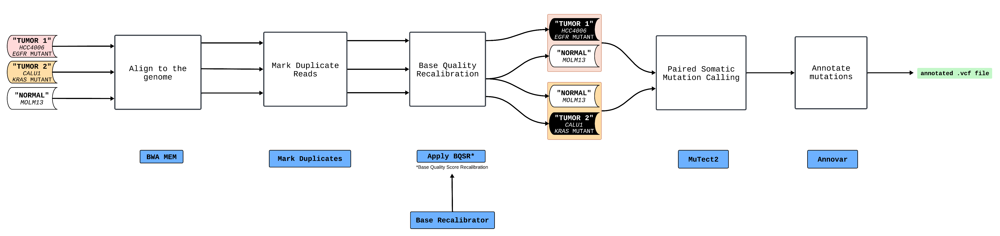

# Defining a workflow plan

Our WDL guide will center around building a workflow from scratch. As we build out this workflow step-by-step, you will see what strategies and resources are used to develop a workflow that is iterative, reproducible, and efficient in terms of time and resource used. The goal is to use this workflow to illustrate common lessons in writing WDL workflows.

## Somatic mutation calling workflow

The workflow used as the example here is tailored to detect somatic mutations in two tumor samples. Initially, the workflow takes as input FASTQ-formatted sequencing data from two tumor specimens and one normal sample (a single normal sample is used here, but typically each tumor might have its own associated normal). Subsequently, it aligns the FASTQ files of each sample with the human reference genome (hg19), proceeds to identify and mark PCR duplicates, and conducts base quality recalibration. Following these steps, the workflow engages in somatic mutation calling, operating in a paired mode, to pinpoint mutations unique to the tumor samples in comparison to the normal one. Concluding the process, the workflow undertakes the annotation of the identified mutations, enriching the dataset with additional insights into the nature of the mutations detected.

The workflow diagram:

The tasks involved:

| Task                    | Function                                          | Inputs                | Outputs           |
|-----------------|---------------------|-----------------|-------------------|
| `BwaMem`                | aligns the samples to the reference genome (hg19) | FASTA (`.fasta`) file | `BAM (.bam)` file |
| `MarkDuplicates`        | marks PCR duplicates                              | BAM (`.bam)` file     | BAM (`.bam)` file |
| `ApplyBaseRecalibrator` | performs base quality recalibration               | BAM (`.bam)` file     | BAM (`.bam)` file |
| `Mutect2`               | performs paired somatic mutation calling          | BAM (`.bam)` file     | VCF (`.vcf)` file |
| `annovar`               | annotates the called somatic mutations            | VCF (`.vcf)` file     | VCF (`.vcf)` file |

## Workflow testing strategy

As we build out our workflow, how can we verify that it is running correctly besides getting a message such as "Workflow finished with status 'Succeeded'" or an exit code 0? In [software development](https://www.atlassian.com/continuous-delivery/software-testing), it is essential to test your code to see whether it generates the expected output given a specified input. This principle applies into bioinformatics workflow development also:

1.  *Unit Testing*: We need to incorporate tests to ensure that each task we develop is correct.

2.  *End-to-end testing*: When we connect all the tasks together to form a workflow, we test that the workflow running end-to-end is correct.

Here are some guidelines for any form of testing:

-   The data you use for testing needs to be representative of "real" data.

-   You should have an *expectation* of what the resulting output is *before* you run your workflow on it. It can be as specific as a MD5 checksum, or vague such as a certain file format.

-   The process is quick to run, ideally in the range of just a few minutes. This often means using a small subset of actual data.

-   The data you use for testing is ideally open access so others can verify your workflow also.

## Test samples

To serve as an example we use here whole exome sequencing data from three cell lines from the [Cancer Cell Line Encyclopedia](https://pubmed.ncbi.nlm.nih.gov/31068700/).

### Tumor 1 : HCC4006

HCC4006 is a lung cancer cell line that has a mutation in the gene *EGFR* (Epithelial Growth Factor Receptor), a proto-oncogene. Mutations in *EGFR* result in the abnormal constitutive activation of the EGFR signaling pathway and drive cancer. In this cell-line specifically, the *EGFR* mutation is an in-frame deletion in Exon 19. This mutation results in the constitutive activation of the EGFR protein and is therefore oncogenic.

### Tumor 2 : CALU1

CALU1 is a lung cancer cell line that has a mutation in the gene *KRAS* (Kirsten rat sarcoma viral oncogene homolog) . *KRAS* is also a proto-oncogene and the most common cancer-causing mutations lock the protein in an active conformation. Constitutive activation of *KRAS* results in carcinogenesis. In this cell-line *KRAS* has a point/missense mutation resulting in the substitution of the amino acid glycine (G) with cysteine (C) at position 12 of the KRAS protein (commonly known as the KRAS G12C mutation). This mutation results in the constitutive activation of KRAS and drives carcinogenesis.

### Normal : MOLM13

MOLM 13 is a human leukemia cell line commonly used in research. While it is also a cancer cell line for the purposes of this workflow example we are going to consider it as a "normal". This cell line does not have mutations in *EGFR* nor in *KRAS* and therefore is a practical surrogate in lieu of a conventional normal sample

### Test data details

Fastq files for all these three samples were derived from their respective whole exome sequencing. However, for the purpose of this guide we have limited the sequencing reads to span +/- 200 bp around the mutation sites for both genes. In doing so we are able to shrink the data files for quick testing.

<iframe src="https://docs.google.com/forms/d/e/1FAIpQLSeEKGWTJOowBhFlWftPUjFU8Rfj-d9iXIHENyd8_HGS8PM7kw/viewform?embedded=true" width="640" height="886" frameborder="0" marginheight="0" marginwidth="0">

Loading...

</iframe>
